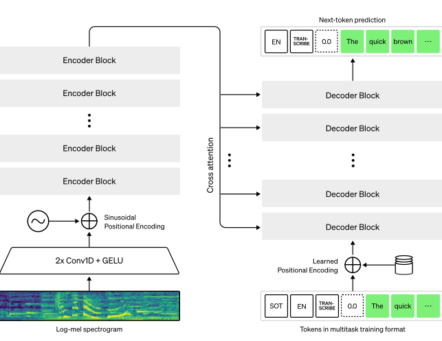

# Audio-Transcription
## Overview
This repository provides a simple solution for converting audio files into text using state-of-the-art voice-to-text technology. With this tool, spoken words can be easily transcribed into written text.

## About Whisper
Whisper is an open-source Automatic Speech Recognition (ASR) model developed by OpenAI. It is designed to provide high-quality transcriptions across various languages and accents, making it a versatile tool for voice-to-text applications. 

This repository leverages the base model of Whisper, which strikes a balance between performance and speed, offering reliable transcription results while maintaining computational efficiency.

## Features
- **User-Friendly Interface** : Comes with a Streamlit app  `streamlit_whisperpy` that provides a graphical interface for users to upload audio files and view transcriptions.

- **Notebook**: Includes a notebook `audio_transcription.ipynb` for users who prefer a more hands-on approach.